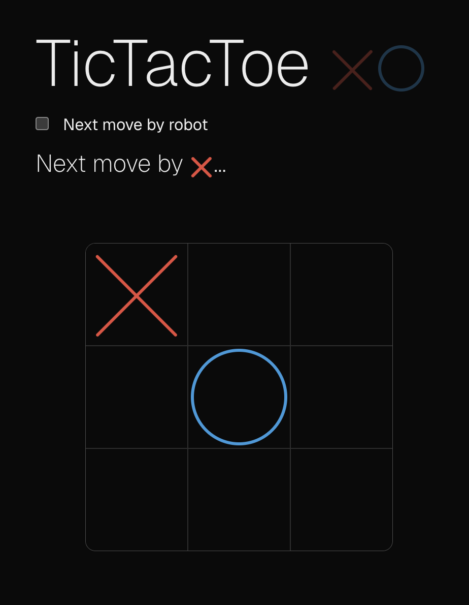

## Getting Started

Thus is a simple TicTacToe game written in TypeScript.

### PS

This is a [Next.js](https://nextjs.org) project bootstrapped with [`create-next-app`](https://nextjs.org/docs/app/api-reference/cli/create-next-app).
